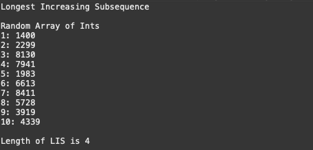

# Longest Increasing Subsequence

*algorithm and implementation adapted from GeeksforGeeks, contributed by Rajat Mishra*

This program generates an array of 10 random ints and outputs the longest increasing subsequence.

## Flow

	- Main generates random int values and populates random values ranging from 0 - 10000 into an int array of size 10.
	- Main then calls the 'wrapperFindMaxSubseq' function. 
	- 'wrapperFindMaxSubseq' initializes the global LIS variable 'lenMaxSubseq' and calls the 'findMaxSubseq' function.
	- 'findMaxSubseq' recurisvely calls itself finding the LIS starting from the beginning of the array to each index.
	- After the recursive exit condition is met(terminates at the last index of the array) LIS of array will be returned to 'wrapperFindMaxSubseq' and then returned to Main.

## Installation

	- Clone and pull source code from provided github repository
	- Compile source code with Java Compiler
	- Run with Java Runtime Environment

## Code

	https://github.com/salabha77/Longest-Increasing-Subsequence

## Usage
	Once run, the console will print the array of 10 randomly generated ints randing from 0 - 10000 followed by the length of the longest increasing subsequence.

